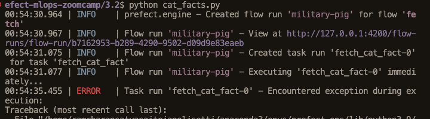
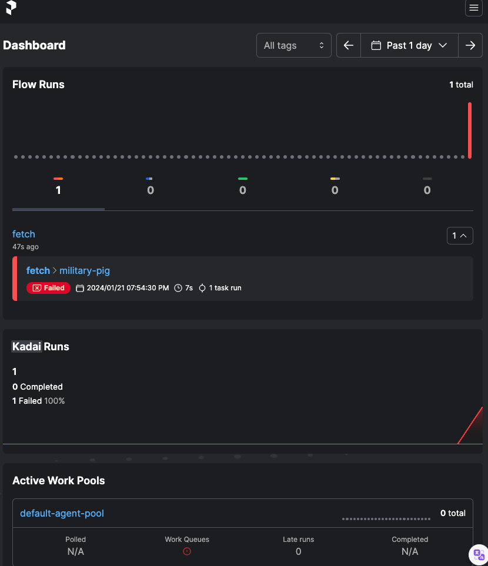
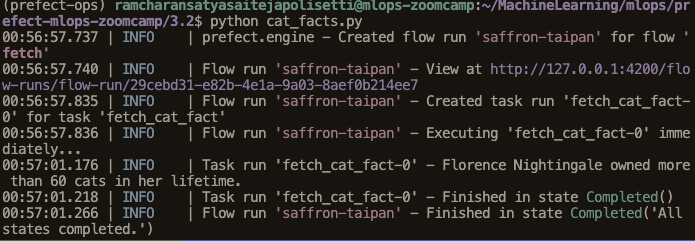

# MLOps Zoomcamp 2023 Week 3


---

This repo contains Python code to accompany the videos that show how to use Prefect for MLOps. We will create workflows that you can orchestrate and observe..

# Setup

## Clone the repo

Clone the repo locally.

## Install packages

In a conda environment with Python 3.10.12 or similar, install all package dependencies with 

```bash
pip install -r requirements.txt
```
## Start the Prefect server locally

Create another window and activate your conda environment. Start the Prefect API server locally with 

```bash
prefect server start
```

Now navigate to another terminal and make sure that you are on same conda environment. Start the Prefect UI with 

```bash
/MachineLearning/mlops/prefect-mlops-zoomcamp$   prefect config set PREFECT_API_URL=http://127.0.0.1:4200/api
Set 'PREFECT_API_URL' to 'http://127.0.0.1:4200/api'.
Updated profile 'default'.
  ```
  




